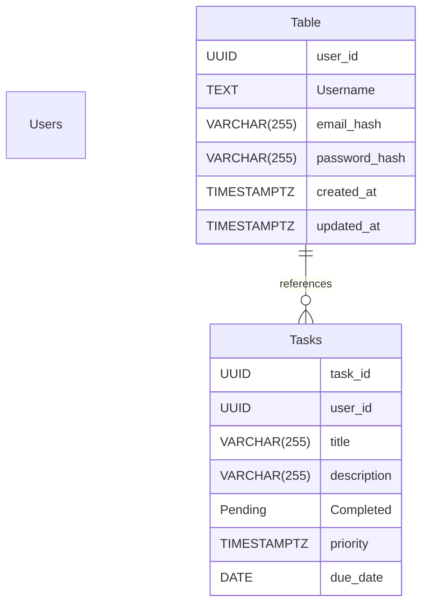

# task Manager documentation
## Summary

- [Introduction](#introduction)
- [Database Type](#database-type)
- [Table Structure](#table-structure)
	- [Users Table](#users table)
	- [Tasks](#tasks)
- [Relationships](#relationships)
- [Database Diagram](#database-diagram)

## Introduction

## Database type

- **Database system:** PostgreSQL
## Table structure

### Users Table

| Name              | Type         | Settings                | References                   | Note |
| ----------------- | ------------ | ----------------------- | ---------------------------- | ---- |
| **user_id**       | UUID         | 🔑 PK, not null, unique | fk_Users Table_user_id_Tasks |      |
| **Username**      | TEXT         | null, unique            |                              |      |
| **email_hash**    | VARCHAR(255) | null                    |                              |      |
| **password_hash** | VARCHAR(255) | null                    |                              |      |
| **created_at**    | TIMESTAMPTZ  | null                    |                              |      |
| **updated_at**    | TIMESTAMPTZ  | null                    |                              |      | 

### Tasks

| Name            | Type         | Settings                | References | Note |
| --------------- | ------------ | ----------------------- | ---------- | ---- |
| **task_id**     | UUID         | 🔑 PK, not null, unique |            |      |
| **user_id**     | UUID         | null, unique            |            |      |
| **title**       | VARCHAR(255) | null                    |            |      |
| **description** | VARCHAR(255) | null                    |            |      |
| **Pending**     |              | null                    |            |      |
| **Completed**   |              | null                    |            |      |
| **priority**    | TIMESTAMPTZ  | null                    |            |      |
| **due_date**    | DATE         | null                    |            |      | 

## Relationships

- **Users Table to Tasks**: one_to_many

## Database Diagram

